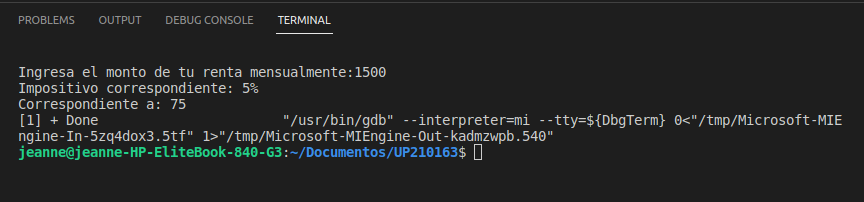
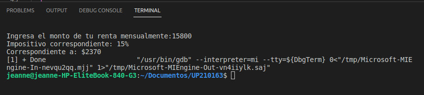
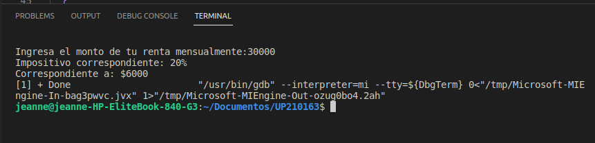
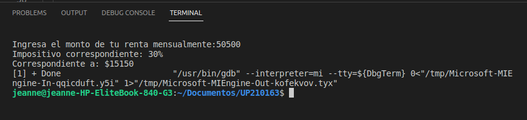
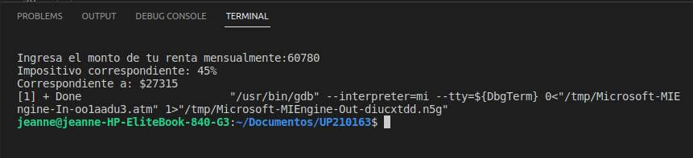

<h1 align="left"> 
EXERCISE 1: Corresponding tax according to the amount of rent of the client
<h4/>
<h2> Code structure (C++)</h2>

```c++
    /----Instanced Libraries----
    #include <iostream>
    #include <stdio.h>
    
    using namespace std;

    int main()
    //----Declaration of variables----
      int renta;
      int descuento=0;
      int pago=0;
      char texto1[40]="Impositivo correspondiente: ";
      char texto2[40]="Correspondiente a: $";


    //----Request rent amount to the user----
      cout<<"Ingresa el monto de tu renta mensualmente:";
      cin>>renta;
 
    //----Calculation and printing of taxes----
      if(renta<10000){
        cout<<texto1<<"5%"<<endl;
        descuento= (renta/100)*5;
        pago=descuento;
        cout<<texto2<<pago<<endl;
    
      }
      if(renta>=10000 && renta<20000){
        cout<<texto1<<"15%"<<endl;
        descuento= (renta/100)*15;
        pago=descuento;
        cout<<texto2<<pago<<endl;
    
      }
       if(renta>=20000 && renta<35000){
        cout<<texto1<<"20%"<<endl;
        descuento= (renta/100)*20;
        pago=descuento;
        cout<<texto2<<pago<<endl;
    
      }
       if(renta>=35000 && renta<60000){
       cout<<texto1<<"30%"<<endl;
        descuento= (renta/100)*30;
        pago=descuento;
        cout<<texto2<<pago<<endl;
    
      }
       if(renta>=60000){
        cout<<texto1<<"45%"<<endl;
        descuento= (renta/100)*45;
        pago=descuento;
        cout<<texto2<<pago<<endl;
    
      }
        return 0;
    }    
```

<h3>Principal function</h3>
<p> Show the user the corresponding tax to pay according to the total amount of rent </p>
<ol>
<li>The user enters the personal amount of rent
<li>The calculations corresponding to the amount entered are performed as follows:
<ol>
<ol type="a">
<li>If the amount is less than $10,000, the tax will be equal to: 5%
<li>If the amount is less than or equal to $10,000 or less than $20,000, the tax will be equal to: 15%
<li>If the amount is less than or equal to $20,000 or less than $35,000, the tax will be equal to: 20%
<li>If the amount is less than or equal to $35,000 or less than $60,000, the tax will be equal to: 30%
<li>If the amount is greater than or equal to $60,000, the tax will be equal to: 45%
</ol>

<h3> Final results</h3>
<ol type="A>
<li>For amount less than $10,000
    
<li>For an amount greater than or equal to $10,000 or less than $20,000
    
 <li>For an amount greater than or equal to $20,000 or less than $35,000
    
 <li>For an amount greater than or equal to $35,000 or less than $60,000
    
 <li>For amounts greater than or equal to $60,000
    
 
 <br><br><br>

<h1 align="left"> 
EXERCISE 2: Benefits (Bonus assigned according to scores) <h4/>
<h2> Code structure (C++)</h2>

```c++
#include <iostream>
#include <stdio.h>

using namespace std;

int main (){
    //----Declaration of variables----
          double calificacion;
          int calculo;
          float bono;
          int cont=1;
          string texto1="¡Thank you very much for preferring us!...";
          
    //----Data collection----
    cout<<"Enter your score: ";
    cin>>calificacion;
//----Bonus calculation-----
    calculo=calificacion*2400;

//----Bonus Allocation----   
   if(calificacion==0.0){
    bono=0;
    cout<<"Unacceptable score : "<<endl;
  
   }
   else if(calificacion==0.4){
   bono=0.4;
  
   }
   else if (calificacion>=0.6){
   bono= 0.6;
   
   }
   else{
    cout<<"Invalid punctuation."<<endl;
    cont=0;
   }
   //----Voucher printing----
   if(cont==1){
     cout<<"Your bonus is: "<<bono<<"%"<<endl;
   cout<<"Corresponding to: $"<<calculo<<endl;
   cout<<texto1<<endl;
   }

    return 0;
}
```
<h3>Principal function</h3>
<p> This program consists of assigning employees their bonus corresponding to their performance score; the score must be [0.0, 0.4 or greater than 0.6], any other score outside the established ones will be rejected. The percentage equal to your performance score where 100% percent is $2400 and 0% is $0. </p>
<ol>
<li>User enters their score
<li>If the user enters a value other than 0, 0.4 or a number greater than 0.6, the program will not advance and will throw a warning message
<li>If the user enters a valid value, it prints the corresponding bond along with the amount to which it is creditor
<ol>
<br><br>

<h3> Final results</h3>
<ol type="A>
<li>For amount less than $10,000
    
<li>For an amount greater than or equal to $10,000 or less than $20,000
    
 <li>For an amount greater than or equal to $20,000 or less than $35,000
    
 <li>For an amount greater than or equal to $35,000 or less than $60,000
    
 <li>For amounts greater than or equal to $60,000
    
 
 <br><br><br>
 
 
<h1 align="left"> 
 EXERCISE 3: Tickets (Price corresponding to pay according to your age) <h4/>
<h2> Code structure (C++)</h2>

```c++
#include <iostream>
#include <stdio.h>

using namespace std;

int main(){
//----Declaration of variables-----
    int edad;
    int entrada=0;
//-----Data entry-----
    cout<<"Enter your age: ";
    cin>>edad;
//-----Calculation of the entry price-----
   if(edad<4){
    entrada=0;
    cout<<"¡Your entry is free!"<<endl;
   }
   else if(entrada>=4 && entrada <=18){
    entrada=5;
   }
   else{
    entrada=10;
   }
//-----Final price printing-----
   cout<<"The price of your ticket is: $"<<entrada<<endl;
   cout<<"¡Thanks for your preference!"<<endl;


return 0; 
}
```

<h3>Principal function</h3>
<p> This program works based on the age entered by the user, depending on their age a price will be assigned to their ticket</p>
<ol>
<li>The user enters his age
<li>The program begins to assign the price that corresponds to it
<li>The price to pay is printed on the screen
<ol>
<br><br>

<h3> Final results</h3>
<ol type="A>
<li>For amount less than $10,000
    
<li>For an amount greater than or equal to $10,000 or less than $20,000
    
 <li>For an amount greater than or equal to $20,000 or less than $35,000
    
 <li>For an amount greater than or equal to $35,000 or less than $60,000
    
 <li>For amounts greater than or equal to $60,000
    
 
 <br><br><br>
 
 
<h1 align="left"> 
 EXERCISE 4: Pizza (Sample of the menu according to the client's selection) <h4/>
<h2> Code structure (C++)</h2>

```c++
#include <iostream>
#include <stdio.h>

using namespace std;

int main()
{
//----Declaration of variables----
    int pizza;
    int ingredientes;

//----Request rental amount from the user----
    cout << "Do you want a Vegetarian (Digit 1) or Non-Vegetarian (Digit 2) pizza)?" << endl;
    cin >> pizza;
//-----Printing of the selected menu----
    if (pizza == 1)
    {
        cout << "Vegetarian Ingredients: " << endl;
        cout << "2. Pepper" << endl;
        cout << "3. Tofu" << endl;
        cout << "Enter the number of the ingredient of your choice: " << endl;
        cin >> ingredientes;
        if (ingredientes == 2)
        {
            cout << "ORDEN:" << endl;
            cout << "Vegetarian pizza" << endl;
            cout << "Ingredients: " << endl;
            cout << "Mozzarella cheese, tomato sauce and pepper" << endl;
         
        }
        else
        {      
            cout << "ORDEN:" << endl;
            cout << "Vegetarian pizza" << endl;
            cout << "Ingredients: " << endl;
            cout << "Mozzarella cheese, tomato sauce and tofu" << endl;
        }
    }
    else if (pizza == 2)
    {
        cout << "Non Vegetarian Ingredients: " << endl;
        cout << "4.Pepperoni" << endl;
        cout << "5.Ham" << endl;
        cout << "6.Salmon" << endl;
        cout << "Enter the number of the ingredient of your choice: " << endl;
        cin >> ingredientes;
        if (ingredientes == 4)
        {
            cout << "ORDEN:" << endl;
            cout << "Non Vegetarian Pizza" << endl;
            cout << "Ingredients: " << endl;
            cout << "Mozzarella cheese, Tomato sauce and Pepperoni" << endl;
        }
        else if (ingredientes == 5)
        {
            cout << "ORDEN:" << endl;
            cout << "Non Vegetarian Pizza" << endl;
            cout << "Ingredients: " << endl;
            cout << "Mozzarella cheese, Tomato sauce and Ham" << endl;
        }
        else
        {
            cout << "ORDEN:" << endl;
            cout << "Non Vegetarian Pizza" << endl;
            cout << "Ingredients: " << endl;
            cout << "Mozzarella cheese, Tomato sauce and salmon" << endl;
        }
    }
    else
    {
        cout << "Invalid option";
    }
    

    return 0;
}
```
<h3>Principal function</h3>
<p> This program is based on taking the client's order with the established options and at the end its complete order is printed to be seen by the user.</p>
<ol>
<li>The program asks the user what type of pizza he wants
<li>With the previous information, the menu corresponding to this selection is displayed.
<li>At the end, the user can view their complete order to check that it is correct.
<ol>
<br><br>

<h3> Final results</h3>
<ol type="A>
<li>For amount less than $10,000
    
<li>For an amount greater than or equal to $10,000 or less than $20,000
    
 <li>For an amount greater than or equal to $20,000 or less than $35,000
    
 <li>For an amount greater than or equal to $35,000 or less than $60,000
    
 <li>For amounts greater than or equal to $60,000
    
 
 <br><br><br>
 
 
<h1 align="left"> 
 Temperatures (calculation of the average, minimum and maximum amount according to the temperature given by the user)<h4/>
<h2> Code structure (C++)</h2>

