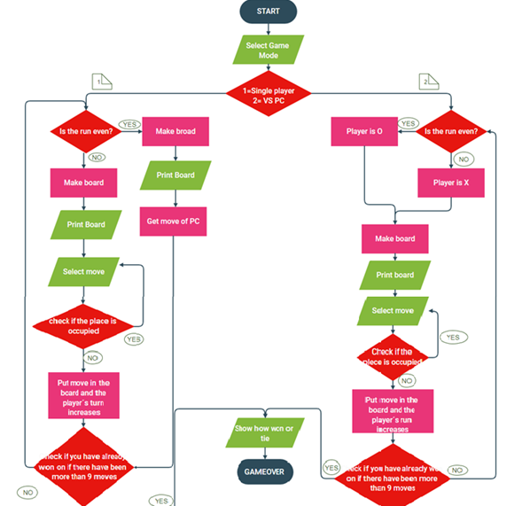

<h1>

# **TIC TAC TOE**
 

>## **Index:** 

>### [Execution and considerations](#1-Execution)  
>### [Flowchart](#2-Flowchart)  
>### [Game explanation](#3-Game)  
>### [Advantages and limitations](#4-Advantages)  

</h3>

>### **1-Execution:**
  <table width="75%" align="left" border="0" cellspacing="0" cellpadding="0">
<tr>
<td>
<fieldset>
To enjoy the game we offer you the following instructions
<h2>Windows</h2>

1. Download or clone my repo with the following command in the terminal:
   
~~~
"git clone https://github.com/UP210052/UP210052_CPP.git"
~~~

2. Download and install the compiler in this link https://sourceforge.net/projects/mingw/files/OldFiles/ 
3. Open the terminal at the direction of the file with the command:

~~~
cd C:\Documents\...
~~~

4. To compile use command:

~~~
gcc  04_Gato.cpp -o 04_Gato.exe
~~~

5. To run type this code:

~~~
04_Gato.exe
~~~

<h2> Linux (Ubuntu)</h2>

1. Download or clone my repo with the following command in the terminal:
   
~~~
"git clone https://github.com/UP210052/UP210052_CPP.git"
~~~

2. Install GNU c/c++ compiler, open the terminal and type:

~~~
$ sudo apt-get update
$ sudo apt-get install build-essential manpages-dev
~~~

3. To compile this program, type:

~~~
gcc 04_Gato.c -o 04_Gato
~~~

4. To run this program, type:

~~~
./04_Gato
~~~

</fieldset>
</td>
</tr>
 </table>                                               
 
 
>### **2-Flowchart:**

 

 
>### **3-Game:**
 
 

<h2>Player vs PC</h2>

The first thing that appears on the screen is a menu to choose the game mode.  
  
Select 1 since we are going to play vs. the PC. The game board will appear with numbers from 1 to 9 to select the move.   
  
Now we will start playing against the PC, my first move is on cell 5. On the other hand, the PC's first move is always random.  
  
My second move is on cell 9. The computer now counters by placing its move on cell 1.   
  
My third move is on cell 7 to prevent the computer from winning. The PC counters by putting his move in cell 3 to prevent me from winning.
  
My fourth move is in cell 8. The CP counters by putting their move in cell 8 to prevent me from winning.  
  
As the cells ran out, the game ended
 
 
 

 
>### **4-Advantages:**

