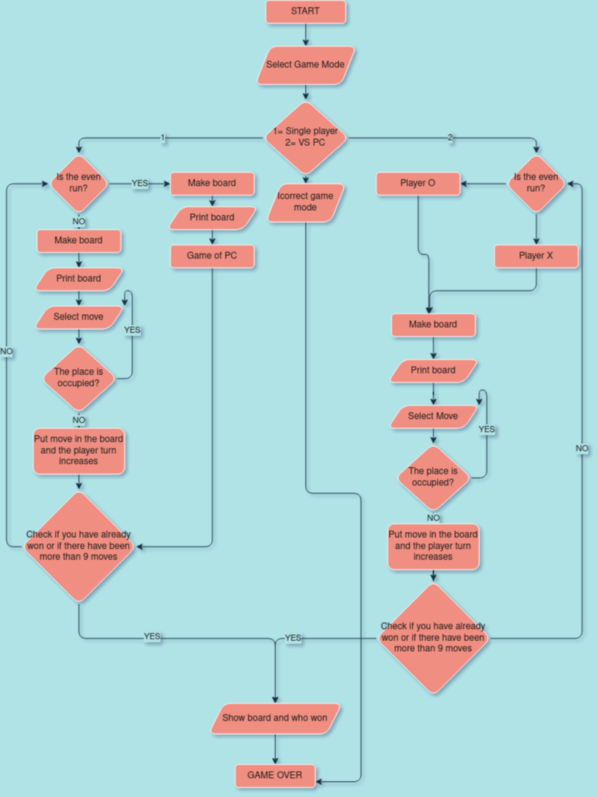

<h1>

# **TIC TAC TOE**
 

>## **Index:** 

>### [Execution and considerations](#1-Execution)  
>### [Flowchart](#2-Flowchart)  
>### [Game explanation](#3-Game)  
>### [Advantages and limitations](#4-Advantages)  

</h3>

>### **1-Execution:**
  <table width="75%" align="left" border="0" cellspacing="0" cellpadding="0">
<tr>
<td>
<fieldset>
To enjoy the game we offer you the following instructions
<h2>Windows</h2>

1. Download or clone my repo with the following command in the terminal:
   
~~~
"git clone https://github.com/UP210163/UP210163_CPP.git"
~~~

2. Download and install the compiler in this link https://sourceforge.net/projects/mingw/files/OldFiles/ 
3. Open the terminal at the direction of the file with the command:

~~~
cd C:\Documents\...
~~~

4. To compile use command:

~~~
gcc  04_Gato.cpp -o 04_Gato.exe
~~~

5. To run type this code:

~~~
04_Gato.exe
~~~

<h2> Linux (Ubuntu)</h2>

1. Download or clone my repo with the following command in the terminal:
   
~~~
"git clone https://github.com/UP210163/UP210163_CPP.git"
~~~

2. Install GNU c/c++ compiler, open the terminal and type:

~~~
$ sudo apt-get update
$ sudo apt-get install build-essential manpages-dev
~~~

3. To compile this program, type:

~~~
gcc 04_Gato.c -o 04_Gato
~~~

4. To run this program, type:

~~~
./04_Gato
~~~

</fieldset>
</td>
</tr>
 </table>                                               
 
 
>### **2-Flowchart:**

 

 
>### **3-Game:**
 
 

<h2>Player vs PC</h2>
<ol>
<li>Here is the process of a machine vs. human play
  
<li>  
<li>  
<li>  
 </ol>
 

 
>### **4-Advantages:**

